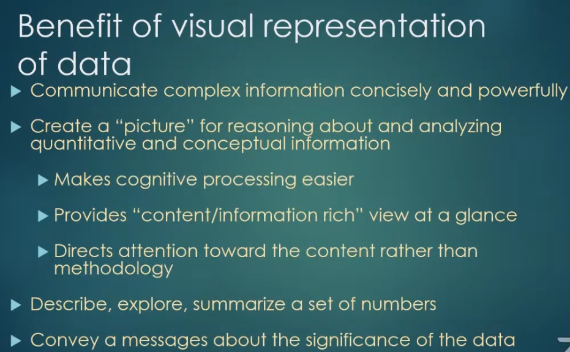
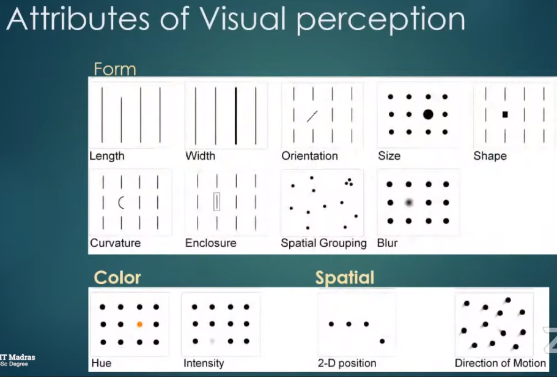
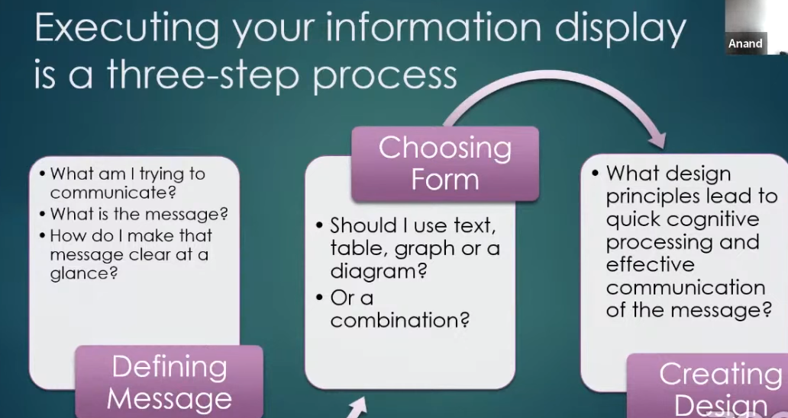
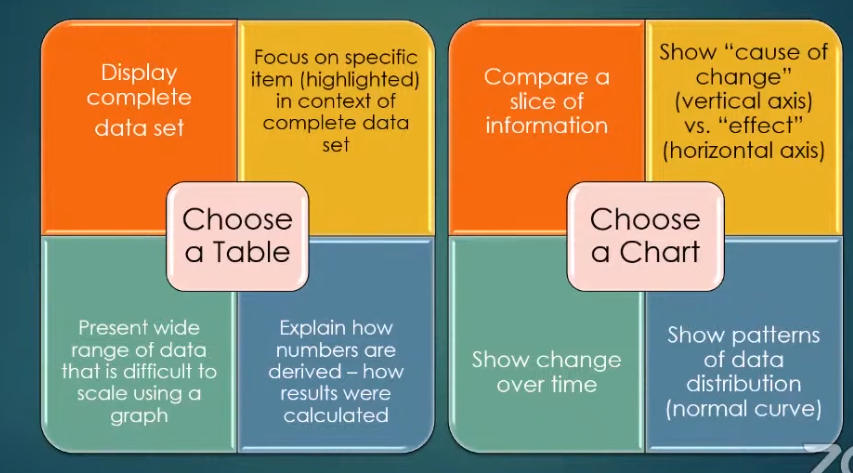
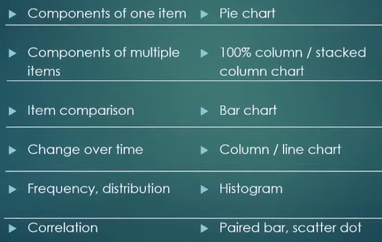

# Data Visualization

# Four Umbrella Principles of Effective Visualization

 - Know Purpose
   - You need to have a purpose statement for every table of graph you create and design the display to serve the purpose.

 - Ensure Integrity
   - Not only that the information correct, but that it is presented in a way that doesn't distort the truth.

 - Maximize data ink :
   - Minimize non-data ink. 

 - Show your data: Annotate
    - Annotating the data is essentially to help the users.

 

# Executing Information

 - Choosing Form : Table or Chart

 - Appropriate graph type for message
 

